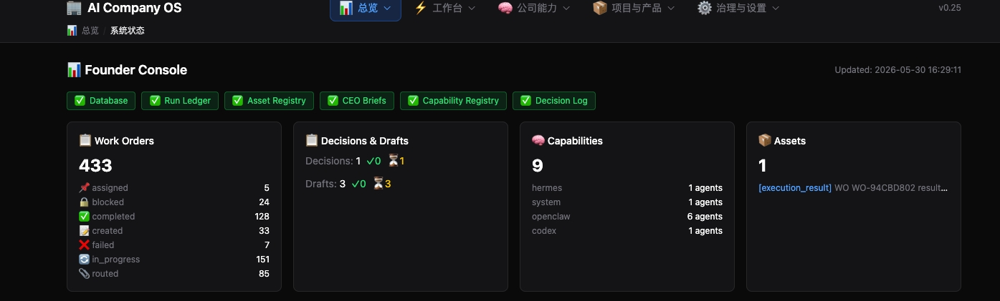
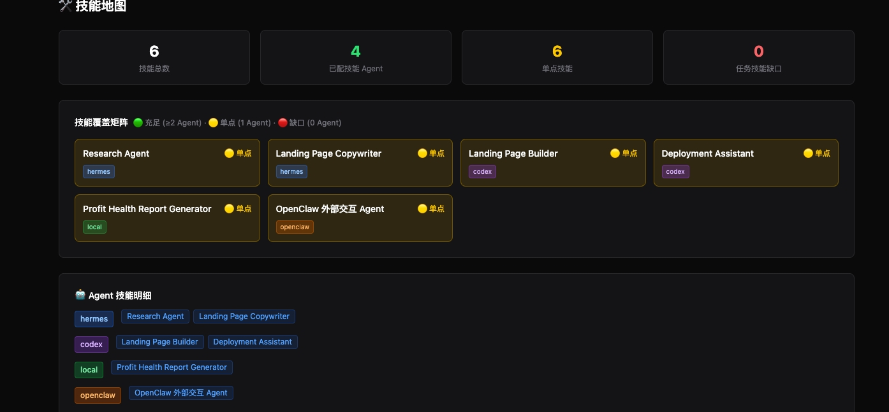
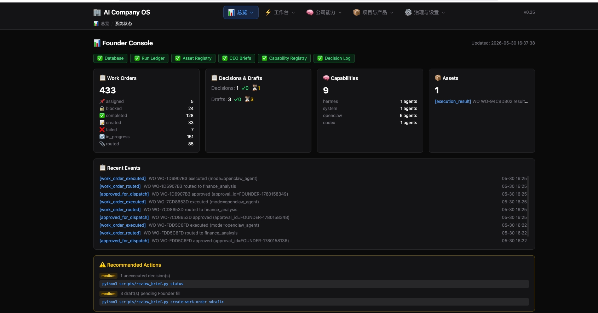
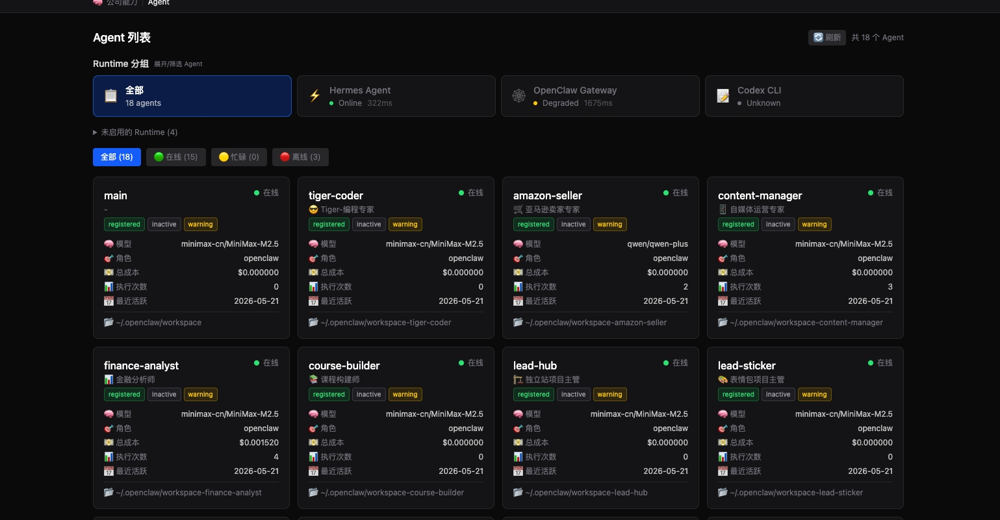

# AI Company OS

**A governance-first operating system for AI-native companies — starting from solo founders.**

AI Company OS is not an agent framework. It is a company operating layer that manages AI agents through structured governance, execution pipelines, and evidence tracking.

**Current Version:** `v0.25` — Founder Control Plane  
**Status:** Active, founder-built, local-first. Not a hosted SaaS.

```
Most people are building agents.
We are building the operating system around them.
```

---

## 🏗️ Architecture

The system is organized into 5 layers:

| Layer | What It Does |
|:------|:-------------|
| **Execution Spine** | CEO Brief → Review → Decision → Draft → Work Order → Approve → Execute → Callback → Result Sync |
| **Governance Kernel** | Budget Guard, Failure Policy, Skill Router, Preflight Checks, Capability Registry |
| **Memory & Asset Layer** | Run Ledger (event-sourced audit trail) + Asset Registry (idempotent pipeline tracking) |
| **Founder Control Plane** | Hermes Agent (Chief of Staff) + `ceo_cmd.py` (Structured CLI) + Control Center Dashboard (Web UI) |
| **Productization & Evidence** | Evidence Dashboard Lite, public-facing system summary, GitHub narrative |

### Founder Access

```
Hermes Agent ──────────── Open-ended chat, strategic discussion, task delegation
ceo_cmd.py ────────────── Structured OS interface for Hermes/automation
Control Center Dashboard ── Web-based Founder console: 5-tab navigation
```

---

## 📊 Evidence

> *"The system itself is the best documentation."*

| Evidence | Link |
|:---------|:-----|
| 📈 Evidence Summary (JSON) | [evidence-summary-v0.26.json](./docs/evidence/evidence-summary-v0.26.json) |
| 📋 Evidence Dashboard (Markdown) | [EVIDENCE-DASHBOARD-LITE-v0.26.md](./docs/evidence/EVIDENCE-DASHBOARD-LITE-v0.26.md) |
| ✅ Preflight Health | [11/11 checks passing](docs/known-issues/KNOWN-ISSUES-v0.26.md) |
| 🛠️ Capability Registry | [config/capability-registry.yaml](./config/capability-registry.yaml) |
| 📊 Run Ledger | 66 events · 9 event types |
| 📦 Asset Registry | Pipeline asset tracking with lineage |

### Screenshots

| Component | Preview |
|:----------|:--------|
| **Founder Console Dashboard** — system overview, health checks, WO stats, recent events |  |
| **Preflight Health Checks** — 11/11 all passing |  |
| **Skills Coverage Matrix** — agent skill mapping with coverage indicators |  |
| **Workbench Tab** — task pool, execution, chat |  |
| **Agent List** — runtime-grouped agent cards with status |  |

---

## 🚀 Version Milestones

| Version | Layer | What It Proves | Status |
|:--------|:------|:---------------|:------:|
| v0.1–v0.9 | Foundation | Visibility, Task Loop, CEO Agent, Memory, Monitor, Runtime, Self-Improvement, Execution Bridge, Code Bridge | ✅ |
| **v0.10–v0.14** | **Execution & Callback** | Work Order lifecycle, OpenClaw bridge v2, Callback API contract, Idempotency, Force overwrite | ✅ |
| **v0.15–v0.16** | **Governance** | Skill Registry + Router, Budget Guard, Failure Policy, Health Checks | ✅ |
| **v0.17–v0.19** | **Documentation & QA** | Architecture docs, release notes, known issues, screenshot baseline | ✅ |
| **v0.20–v0.22** | **Studio Integration** | Codex CLI, Claude Code, OpenClaw worker, Executor/Approver separated | ✅ |
| **v0.23** | **Memory & Assets** | Run Ledger event sourcing, Asset Registry, idempotent pipeline tracking | ✅ |
| **v0.24** | **CEO Command** | `ceo_cmd.py` structured CLI, Capability Registry P0 | ✅ |
| **v0.25** | **Founder Control Plane** | 5-tab IA reorganization, Founder Console Dashboard, Preflight 11/11 | ✅ |
| **v0.26** | **Evidence & GitHub Refresh** | Evidence Summary Generator, Evidence Dashboard Lite, GitHub narrative | 🏗️ |

📋 **Full roadmap**: [AI-COMPANY-OS-ROADMAP.md](./docs/AI-COMPANY-OS-ROADMAP.md)

---

## 🖥️ Quick Start

```bash
# Backend
cd backend
pip install -r requirements.txt
uvicorn app.main:app --reload --port 8001

# Frontend
cd frontend
npm install
npm run dev -- -p 3001
```

```
# Generate evidence summary
python3 scripts/ceo_cmd.py evidence generate --format both

# Validate evidence output
python3 scripts/ceo_cmd.py evidence validate
```

> **⚠️ Early system**: This is still a founder-built local system. Setup assumes Python/Node environment and existing runtime data. A full "clone and run" experience is not yet available.

---

## 🧭 Repository Structure

```
├── backend/               FastAPI backend — models, routes, services
├── frontend/              Next.js Control Center — 5-tab dashboard
├── config/                Capability Registry, instance configuration
├── scripts/               ceo_cmd.py, os_registry.py, review_brief.py
├── reports/               CEO Briefs, Reviews, Decision Log, Drafts
│
├── docs/
│   ├── architecture/      System architecture documentation
│   ├── prd/               Product requirement documents
│   ├── releases/          Release notes per version
│   ├── evidence/          Public evidence dashboard data
│   ├── known-issues/      Pre-existing error records
│   └── AI-COMPANY-OS-ROADMAP.md
│
└── examples/              Real project cases
```

---

## 👤 Who This Is For

AI Company OS is currently built and tested by one founder using AI agents to run real projects.

| Role | Need |
|:-----|:-----|
| **Solo Founder** | Replace headcount with AI agents, maintain governance |
| **AI-Native Team** | System that works for ONE founder can be adapted for TEAMS |
| **Agent Builder** | See what a production OS looks like — not a demo |

**Solo founder is the starting point, not the ceiling.**

### Current Limitations

- **Local-first** — not a hosted SaaS platform
- **Single-founder** — optimized for solo operations
- **No multi-user permissions** — founder-trusted by design
- **Evidence is summarized** — not live public telemetry
- **Founder approval required** — for high-risk execution
- **Some workflows CLI-assisted** — not fully automated

---

## 🔍 How to Read This Repository

| Order | What | Why |
|:-----:|:-----|:----|
| 1 | `README.md` | System overview, evidence, architecture |
| 2 | `docs/evidence/EVIDENCE-DASHBOARD-LITE-v0.26.md` | See the system running |
| 3 | `docs/AI-COMPANY-OS-ROADMAP.md` | Evolution plan |
| 4 | `docs/architecture/` | System design docs |
| 5 | `config/capability-registry.yaml` | Agent capability declaration |
| 6 | `scripts/ceo_cmd.py` | Structured OS interface |

---

## ❓ Why This Exists

This repository is not a demo. It is a real, running system that a founder uses daily to operate AI agents as part of a company operating layer.

We believe:

- **AI agents will become independent executors**, not just chatbots
- **A company running multiple AI agents needs an OS**, not a single-agent framework
- **The OS must accumulate organizational memory**, enforce safety boundaries, and track cost
- **Solo founders get the most leverage** from AI-native operations

Everything is public because:

- The system itself is the best documentation
- Evidence speaks louder than claims
- Others building in this space should not start from zero

---

## 📜 License

All Rights Reserved. © 2026 AI Company OS.

This project is **source-available for educational and reference purposes** — the code is publicly viewable on GitHub. Commercial use, redistribution, or derivative commercial products are not permitted without explicit permission.

> *A formal commercial license will be available in a future release (see ROADMAP: v0.27+ Operating Kit).*
