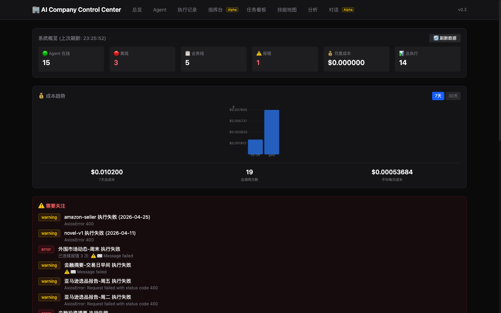
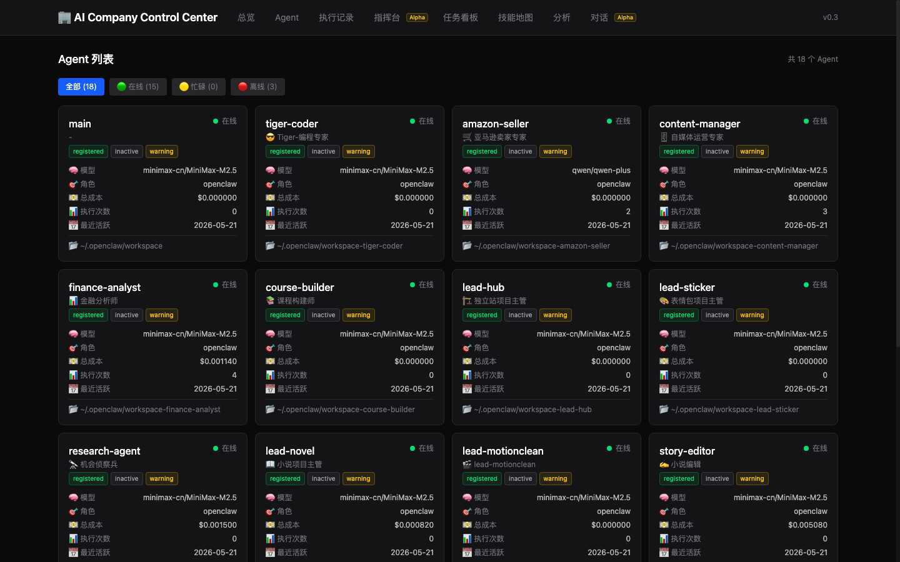
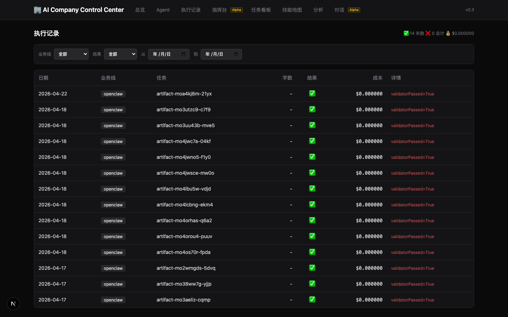
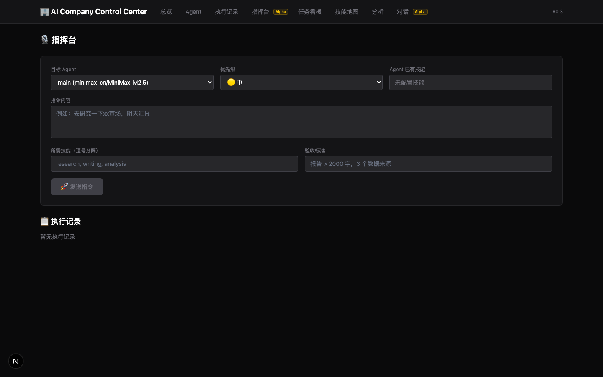

# AI Company Control Center

> **Current Version: AI Company Control Center v0.1.1** ⚡
>
> ✅ **Stable Core**: Dashboard / Agents / Runs / Costs / Alerts — 数据真实，默认不含 Mock
> 🟡 **Alpha Capability**: Command Center / Hermes Chat Panel — 功能可用，三重安全门禁
>
> 一人公司 AI 作战指挥室。把 18 个 Agent 的运行状态、执行记录、成本、告警汇聚成一个可视化面板。
> 数据来自 OpenClaw Runtime，API 默认只返回真实数据（不含 Mock）。
>
> 这是 AI Company OS 的第一阶段可视化看板，不是完整 OS。
> 完整 AI Company OS 包含：方法论与组织协议、技术平台、Runtime 接入、Control Center、证据层和资产沉淀层。

---

## Control Center v0.1 与 AI Company OS 的关系

```
AI Company OS (总品牌)
  ├── AI Company OS Operating Kit — 方法论与组织协议
  ├── AI Company OS Control Center — v0.1 Dashboard (当前)
  ├── Runtime Layer — Hermes / OpenClaw / Codex / Claude Code
  ├── GitHub 证据层 — 开源 + 证据公开
  └── 资产沉淀层 — AI-Knowledge-OS / 书籍 / 文章
```

**Control Center v0.1 = AI Company OS 的第一个可交付版本。**  
它的范围明确限定为：**只读 → 把 OpenClaw 当前运行状态可视化。**

v0.1 不做：
- ❌ CEO Agent
- ❌ TASK-POOL
- ❌ Monitor Agent
- ❌ Memory 4 层
- ❌ 写操作 / 调度能力
- ❌ 修改 OpenClaw runtime

后续版本路线图参见：`docs/AI-COMPANY-OS-ROADMAP.md`  
长期设计约束参见：`docs/AI-COMPANY-OS-CONSTITUTION.md`

---

## 快速开始

### 前提

- Python 3.11+
- Node.js 18+
- OpenClaw 运行时（数据源）
- 端口可用性检查：
  - `8001` — 后端 API（Docker 可能占用 `8000`）
  - `3001` — 前端 Dashboard（Docker 可能占用 `3000`）

### 1. 启动后端

```bash
cd backend
pip install -r requirements.txt
python3.11 -m uvicorn app.main:app --host 127.0.0.1 --port 8001
```

首次启动会自动：
- 创建 SQLite 数据库 `data/ai_company_os.db`
- 如果 OpenClaw 数据源不可用，使用 Mock 数据填充
- 启动后即可访问 API

### 2. 启动前端

新开一个终端：

```bash
cd frontend
npx next dev --port 3001
```

前端默认连接 `http://127.0.0.1:8001`（由 `.env.local` 配置）。

### 3. 访问

| 页面 | 地址 |
|:----|:-----|
| 🏠 总览 Dashboard | http://localhost:3001 |
| 🤖 Agent 列表 | http://localhost:3001/agents |
| 📋 执行记录 | http://localhost:3001/runs |
| 📚 Swagger API 文档 | http://127.0.0.1:8001/docs |

---

## 数据源

v0.1 仅连接 **OpenClaw** 运行时。每次 `POST /api/v1/refresh` 同步以下数据：

| 数据 | 来源 | 方式 |
|:----|:-----|:----:|
| Agent 列表 | `openclaw agents list` | CLI 调用 |
| Cron Jobs | `~/.openclaw/cron/jobs.json` | 直接读取 |
| 执行记录 | `run-ledger-v1/db/production-flow-ledger.json` | 直接读取 |
| 成本 | `workspace-gateway-lite/cost-view/*.json` | 直接读取 |
| 提醒 | 扫描 cron error + 执行失败 | 自动检测 |

---

## API 端点

**Base URL**: `http://127.0.0.1:8001/api/v1`

| 端点 | 方法 | 功能 |
|:-----|:----:|:-----|
| `/health` | GET | 健康检查 |
| `/stats` | GET | 总览统计 |
| `/agents` | GET | Agent 列表（`?status=`） |
| `/agents/{name}` | GET | Agent 详情 |
| `/business-lines` | GET | 业务线列表 |
| `/business-lines/{id}/runs` | GET | 业务线执行记录 |
| `/runs` | GET | 执行记录（支持筛选 `?date_from=&date_to=&business_line=&result=`） |
| `/runs/{run_id}` | GET | 执行详情 |
| `/artifacts` | GET | Artifact 列表 |
| `/costs` | GET | 成本汇总（`?group_by=agent|model|project`） |
| `/costs/daily` | GET | 每日成本（`?date=`） |
| `/cron-jobs` | GET | Cron Jobs 列表 |
| `/alerts` | GET | CEO 提醒列表 |
| `/refresh` | POST | 手动同步 OpenClaw 数据 |
| `/refresh/status` | GET | 查看同步状态 |

---

## 项目结构

```
ai-company-os/
├── backend/
│   ├── app/
│   │   ├── main.py                ← FastAPI 入口
│   │   ├── config.py              ← 配置（路径、数据库）
│   │   ├── database.py            ← SQLAlchemy async/sync
│   │   ├── refresh_orchestrator.py ← 数据同步编排
│   │   ├── seed.py                ← Mock 数据（fallback）
│   │   ├── models/                ← 9 张 ORM 表
│   │   ├── schemas/               ← Pydantic v2 schemas
│   │   ├── routers/               ← 14 个 API 端点
│   │   └── adapters/              ← OpenClaw 数据适配器
│   ├── data/                      ← SQLite 数据库
│   └── requirements.txt
├── frontend/
│   ├── src/
│   │   ├── app/                   ← Next.js App Router 页面
│   │   │   ├── page.tsx           ← 总览 Dashboard /
│   │   │   ├── agents/page.tsx    ← Agent 列表 /agents
│   │   │   └── runs/page.tsx      ← 执行记录 /runs
│   │   ├── lib/api.ts             ← API 客户端
│   │   └── types/api.ts           ← TypeScript 类型
│   └── .env.local                 ← API URL 配置
├── docs/
│   └── openclaw-data-source-scan.md ← 数据源扫描报告
└── README.md
```

---

## 技术栈

| 层 | 技术 |
|:---|:-----|
| 🖥️ 前端 | Next.js 14 (App Router) + Tailwind CSS |
| 🔌 API | FastAPI + Pydantic v2 |
| 🗄️ 持久化 | SQLite + SQLAlchemy 2.0 |
| 🤖 数据源 | OpenClaw CLI + JSON 文件 |

---

## 验收检查

- [x] Agent 列表与 `openclaw agents list` 输出一致
- [x] Cron jobs 数量与 `jobs.json` 一致
- [x] 失败任务自动出现在提醒列表
- [x] 成本数据来自 gateway-lite
- [x] 全部 27 个 API 端点可用
- [x] 前端 9 个页面均可访问
- [x] Swagger 文档可浏览
- [x] Mock 数据默认过滤（`data_source` 字段 + API filter）
- [x] 写操作三重门禁（dry-run + ALLOW_ALPHA_WRITE + X-Confirm）
- [x] Agent 三维状态（discovery / activity / health）

---

## Releases

| 版本 | 日期 | 说明 |
|:-----|:----:|:-----|
| [v0.1.1](docs/releases/AI-COMPANY-CONTROL-CENTER-v0.1.1.md) | 2026-05-21 | 数据可信化 + 安全边界 + Alpha 分层 |
| [v0.1](docs/AI-COMPANY-CONTROL-CENTER-v0.1-ACCEPTANCE-REPORT.md) | 2026-05-21 | 初始版本（骨架搭建 + 功能扩展） |

---

## Screenshots

| 页面 | 预览 |
|:-----|:----:|
| 🏠 Dashboard |  |
| 🤖 Agents |  |
| 📋 Runs |  |
| ⚡ Command Center (Alpha) |  |

---

## 设计参考

- **Anthropic Managed Agents** — Agent/Environment/Session/Events 四层抽象（预留字段）
- **PraisonAI** — AgentTeam/AgentFlow 工作流模式（v0.2+ 参考）
- **atria** — "发现已有 Agent，不替代 Agent"
- **OpenPaw** — Agent Profile / identity / tools / skills / memory 概念
- **Tekton** — pluggable runtime + approval gates（预留字段）

---

## 许可证

MIT
