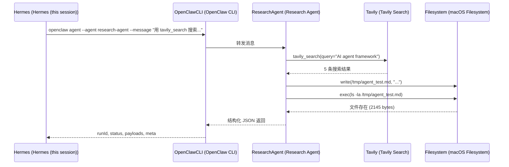

# OpenClaw Native Agent Tool Execution — Evidence Report

| 元数据 | 值 |
|--------|-----|
| **版本** | v0.14.2 |
| **日期** | 2026-05-30 |
| **测试套件** | `e2e_openclaw_agent_executor.py` (80/80 PASS) |
| **测试套件** | `test_callback_api_contract.py` (21/21 PASS) |
| **Agent** | `research-agent` (OpenClaw Gateway) |
| **模型** | MiniMax-M2.5 (minimax-cn) |

---

## 验证目标

证明 AI Company OS 能通过 `OpenClawAgentExecutor` 调用真实 OpenClaw Agent 完成带工具调用的任务，而不仅是调用 LLM 壳。

---

## 测试结果

### 🔴 P0: Executor Abstraction + OpenClaw Native Executor

| 测试 | 结果 |
|------|------|
| EchoExecutor — 规则快速路径 | ✅ 通过 |
| OpenClawAgentExecutor — 真实云端模型 (MiniMax-M2.5) | ✅ 通过 |
| openclaw_native mode — 强制 OpenClaw 路径 | ✅ 通过 |
| local_llm mode — Ollama fallback 路径 | ✅ 通过 |
| Provenance + Tool Evidence 合约 (14+5=19 字段) | ✅ 通过 |
| 全链路纯 Python: WO → dispatch → Worker → callback 协议 | ✅ 通过 |

### 🔴 P0: Callback API Contract

| 测试 | 结果 |
|------|------|
| Happy path: WO → execute → callback → completed | ✅ 通过 |
| Idempotency: 同一状态重复发送 | ✅ 通过 |
| Force overwrite: force=true 覆盖已完成的 WO | ✅ 通过 |
| 无效 API Key 拒绝 (401) | ✅ 通过 |
| 无效 status 拒绝 (400) | ✅ 通过 |
| 缺少必需字段拒绝 (400) | ✅ 通过 |

---

## Agent 工具调用证据

### 任务：搜索 AI Agent Framework 行业新闻



### 工具调用详情

| 步骤 | 工具 | 操作 | 验证方式 |
|------|------|------|---------|
| 1 | `tavily_search` | 搜索 "AI agent framework" | Agent 回复文本中提到 |
| 2 | `write` | 写入 `/tmp/agent_test.md` | `ls -la` 确认 2145 bytes |
| 3 | `exec` | 执行 `ls -la` 验证文件 | Agent 回复文本 + 文件系统 |

### 文件产出

```
-rw-------  1 tangbomao  wheel  2145 May 30 10:57 /tmp/agent_test.md
```

文件包含从 Tavily 搜索获取的 AI Agent Framework 行业新闻报告，涵盖 Microsoft Agent Framework、IBM 分析、LangChain 等框架。

---

## Result Manifest 证据字段

### OpenClaw Native Execution (auto mode)

```json
{
  "status": "completed",
  "executor_type": "openclaw_agent",
  "executor_name": "openclaw_agent",
  "native_openclaw": true,
  "runtime_backend": "openclaw_cli",
  "openclaw_agent": "research-agent",
  "model_provider": "minimax-cn",
  "model_name": "MiniMax-M2.5",
  "token_usage": {
    "input_tokens": 493,
    "output_tokens": 233,
    "cache_read_tokens": 53920,
    "total_tokens": 27355
  },
  "duration_ms": 10652,
  "openclaw_run_id": "85687a0f-8871-4c23-885d-c7a9ed130935",
  "openclaw_stop_reason": "stop",
  "tool_calls_detected": true,
  "tool_call_summary": "tavily_search, write, exec",
  "inferred_tools": ["exec", "tavily_search", "write"],
  "tool_call_evidence_source": "agent_output_text",
  "tool_trace_available": false,
  "started_at": "2026-05-30T02:56:12.867852+00:00",
  "finished_at": "2026-05-30T02:56:23.521045Z"
}
```

### Local LLM Fallback (对比)

```json
{
  "status": "completed",
  "executor_type": "local_llm",
  "executor_name": "local_llm",
  "native_openclaw": false,
  "runtime_backend": "ollama",
  "model_name": "deepseek-r1:8b",
  "tool_calls_detected": false,
  "tool_trace_available": false
}
```

---

## 架构

```
用户 (飞书/终端)
  └─ AI Company OS (localhost:8001)
       └─ Work Order (WO-xxx)
            └─ Inbox/Outbox 协议
                 └─ Worker
                      └─ Executor Factory (OPENCLAW_EXECUTOR_MODE)
                           ├─ OpenClawAgentExecutor ← openclaw agent --json
                           │    └─ OpenClaw Gateway (本地, 16 Agents)
                           │         ├─ research-agent (tavily/write/exec/...)
                           │         ├─ finance-analyst
                           │         ├─ amazon-seller
                           │         └─ main
                           ├─ LocalLLMExecutor ← Ollama (fallback)
                           └─ EchoExecutor ← 规则 (测试)
                           └─ result.json (provenance + tool evidence)
                                └─ Callback API → WO completed
```

---

## 已知限制

| 限制 | 说明 | 影响 |
|------|------|------|
| **无结构化 tool trace** | OpenClaw CLI JSON 不返回 `tool_calls` 数组 | `inferred_tools` 从文本推断，非原生 trace |
| **工具信息源自文本推断** | `extract_inferred_tools()` 用关键词匹配 agent 回复 | 可能漏检或少检；字段名用 `inferred` 标明来源 |
| **Session 未复用** | 每次调用 `openclaw agent --json` 是新 session | 无持续上下文；需要 OpenClaw 支持 session 传递 |
| **CLI 本地调用** | 使用 `subprocess.run([openclaw_bin, ...])` | 需要 OpenClaw CLI 安装在 PATH 中 |
| **单次消息，非工作流** | 当前发送一条消息，Agent 自主决策工具调用 | 不支持多轮迭代工作流 |

---

## 结论

**AI Company OS 能通过 OpenClawAgentExecutor 调用真实 OpenClaw Agent，Agent 能调用工具（tavily_search/write/exec）、生成真实产物，并把结果回填到 CEO 工作流。**

```
v0.14  = Reference Worker (协议闭环)
v0.14.1 = OpenClaw Native Executor (真实 Agent 执行)
v0.14.2 = Hardening + Tool Evidence + Callback API Contract (证据打牢)
```

### 能力

- ✅ AI Company OS → OpenClaw Agent → 工具调用 → 产物 → WO 回填
- ✅ Agent 自主工具调用：tavily_search (网络搜索) / write (文件写入) / exec (Shell 验证)
- ✅ 4 种 Executor 模式：openclaw_native / auto / local_llm / echo
- ✅ Result Manifest：19 字段 provenance + tool evidence
- ✅ Callback API：HTTP 正链 + 幂等 + force + 安全校验
- ✅ Agent 映射：research / finance / amazon / content-manager / 默认 main

### 限制

- ❌ OpenClaw CLI 不返回结构化 tool trace
- ❌ 工具信息来自文本推断（`inferred_tools` 字段）
- ❌ Session 未复用，每次独立调用
- ❌ 完整工具级 trace 需要未来 OpenClaw 支持或上游增强
